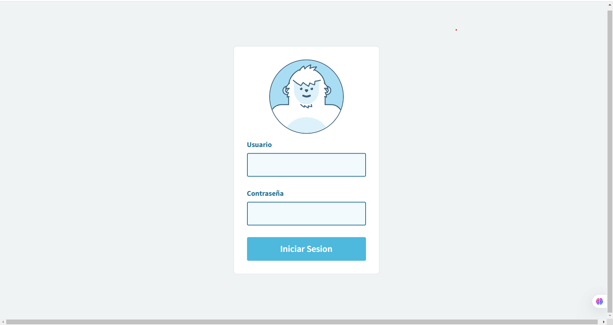

# SistemadeCaja
Este es un sistema de caja funcional, incluye control de inventario, usuarios y control de ventas, ademas de generaciñon de ticket por cada compra.

Sistema de Caja para Gestión de Ventas y Finanzas
El sistema de caja desarrollado por el usuario es una aplicación web diseñada para la gestión eficiente de ventas, control de inventario y administración de caja. Utiliza PHP con Bootstrap 5 para el frontend y una base de datos para almacenar y manejar la información de transacciones.

Características principales:
Gestión de Inventario

Control de productos disponibles.
Registro de entradas y salidas de inventario.
Actualización automática de existencias tras cada venta.
Caja con Generación de Tickets

Registro de ventas en tiempo real.
Generación de tickets de pago tras cada transacción.
Registro de retiros de efectivo de la caja.
Cálculo del total vendido desde el último corte.
Generación de reportes de corte de caja.
Control de Usuarios

Sistema de login con niveles de acceso.
Restricción de acciones según permisos de usuario (por ejemplo, administrador vs. vendedor).
Registro de actividad de los usuarios en la caja.
Reportes y Estadísticas

Generación de reportes de ventas por día, semana o mes.
Descarga de reportes en formatos PDF.
Interfaz Moderna y Optimizada

Diseño responsive utilizando Bootstrap 5.
Integración de AJAX para edición y actualización de datos sin recargar la página.
Uso de DataTables para una visualización clara y dinámica de la información.
Este sistema ofrece una solución integral para la gestión de ventas y caja, asegurando un control eficiente del dinero y del inventario.

